# linuxstudy

first

-基本命令

- 文件操作命令 （rm mkdir chmod chown）
- 编辑工具使用(vi vim )
- linux用户管理（useradd userdel usermod）
- setup 启动服务

## **1.vmtools安装**

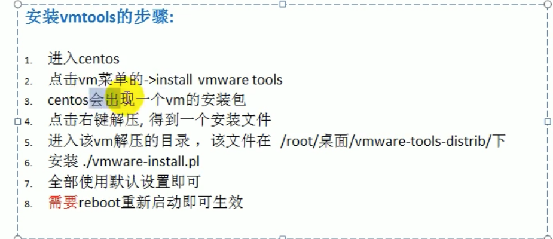

### 1.linux目录结构

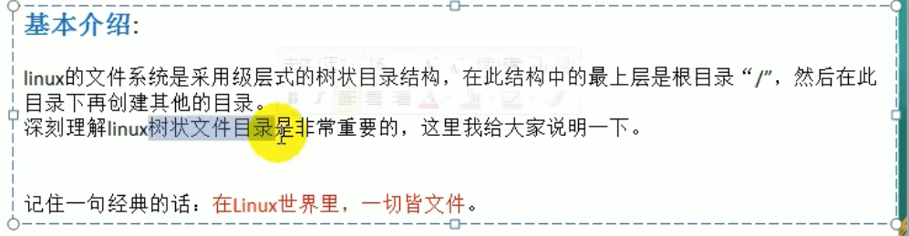

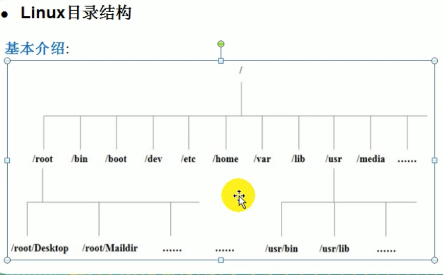

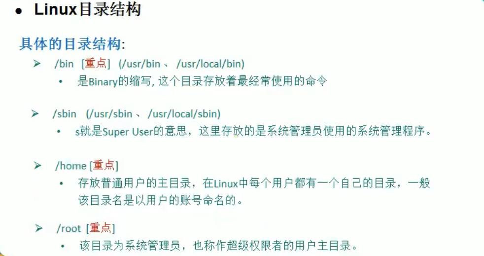

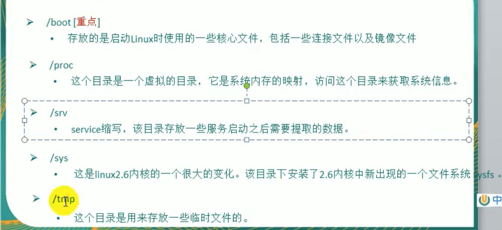

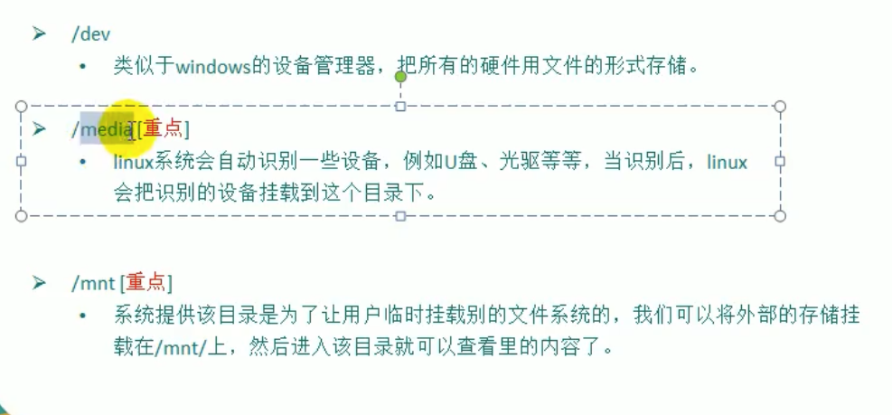

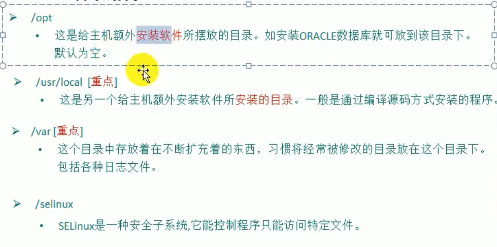

### 2.远程登陆linux

#### 1.远程登录

XShell5 远程登陆软件

XFtp5 上传与下载文件软件

获取linux **ip**地址 ifconfig

打开xshell

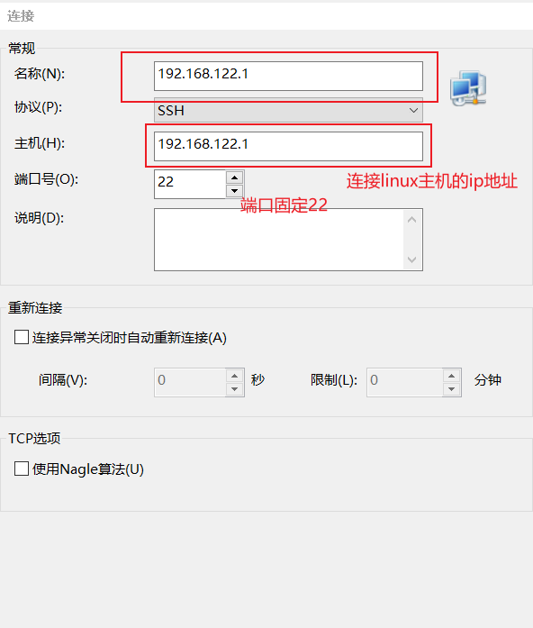

- 注意：联网

连接成功

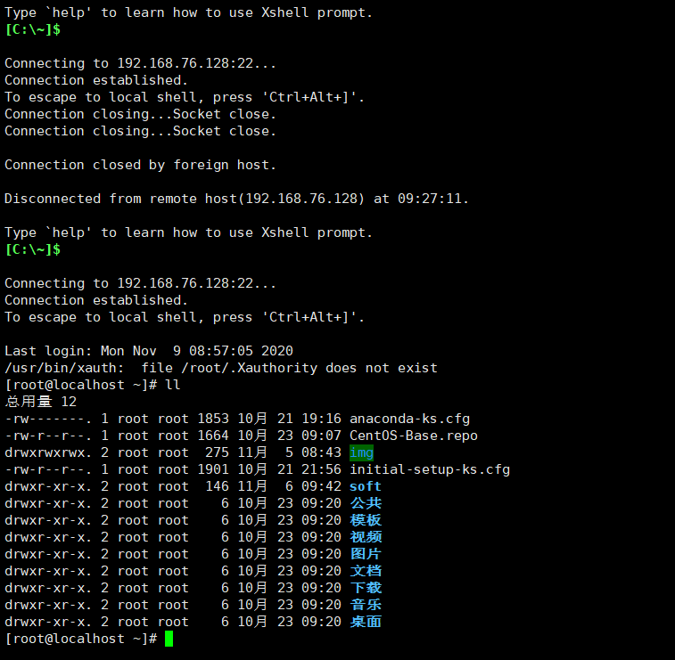

- reboot-远程 重启linux系统

#### 2.远程上传下载文件

传输软件xftp5

##### 1.xftp7的配置

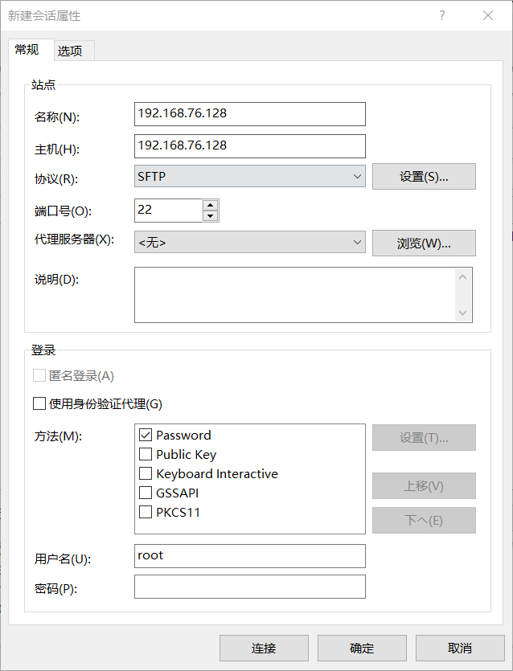

- 出现乱码-点击linux主机属性-使用utf-8编码

## 2.linux实操

### 1.vi ，vim编辑器

Vim是从 vi 发展出来的一个文本编辑器。代码补完、编译及错误跳转等方便编程的功能特别丰富，在程序员中被广泛使用。

简单的来说， vi 是老式的字处理器，不过功能已经很齐全了，但是还是有可以进步的地方。 vim 则可以说是程序开发者的一项很好用的工具。

- vi/vim 三种常见模式

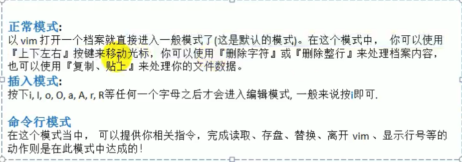

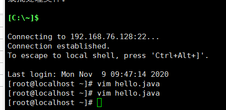

vim 打开/创建文件

i键 进入编辑模式

:wq 保存并退出

:q 退出

:q! 强制/不保存退出

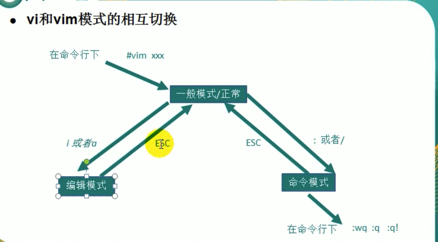

- vi,vim常用快捷键

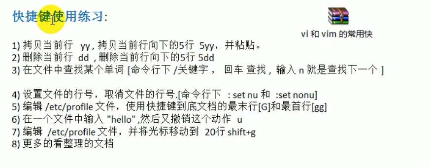

粘贴p

### 2.linux基本指令

#### 1.基本介绍

shutdown

​	shutdown -h now 立刻关机

​	shutdown -h 1     1分钟后关机

​	shutdown -r now  	立刻重启计算机

halt  关机，作用同上

reboot 重启计算机

sync 将内存的数据同步到磁盘

​	注意：
不管是重启系统还是关闭系统，首先运行sync命令，将内存数据保存到磁盘。

#### 2.用户登录和注销

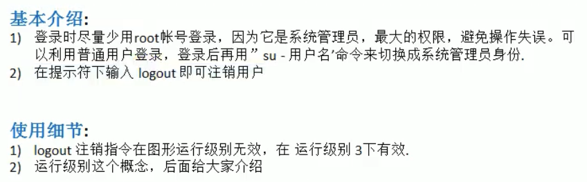

### 3.用户管理

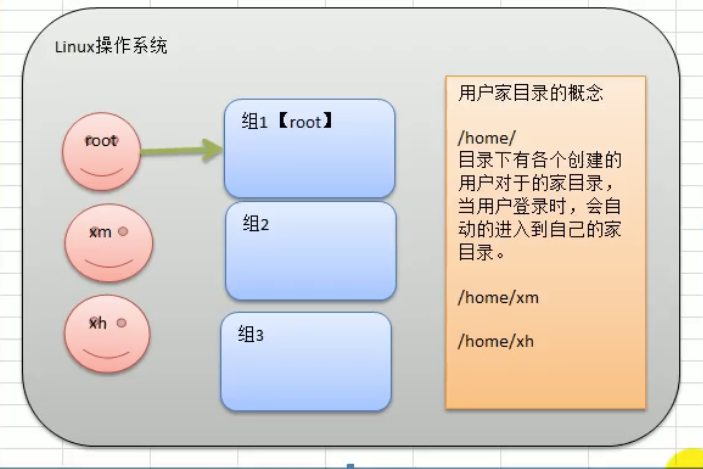

#### 添加用户：

基本语法 

​	useradd [选项] 用户名

--cd 切换目录

细节说明

1. 当创建用户成功后，会自动创建和用户同名的家目录
2. 也可通过useradd -d 指定目录  新的用户名 ，给新创建的用户指定家目录

-给用户指定密码

#### 删除用户：

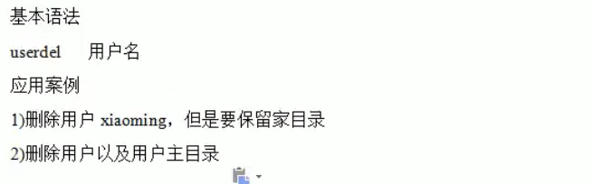

1.删除用户，但保留家目录 

userdel yousa（用户名）

2.删除用户和用户主目录

userdel -r 用户名

**注意**：

​	在删除用户时 ，一般会保存用户家目录

#### 查询用户信息：

id +用户名

--当用户不存在会返回无此用户

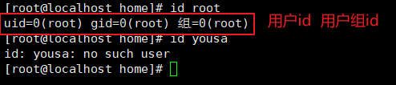

#### 切换用户：

​	su - 用户名

​	exit 返回

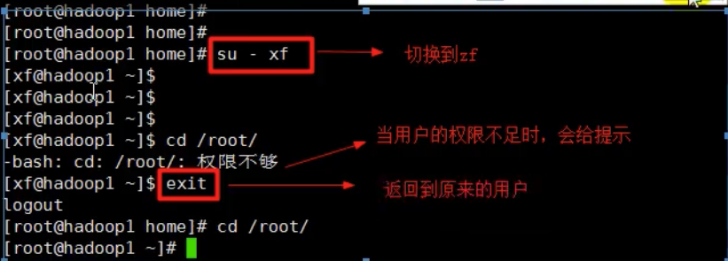

**注意**：

1.从权限高的用户切换到权限低的用户不需要输入密码，反之需要

2.当需要返回原来的用户时，使用exit指令

**查看当前用户、登录用户**

​	whoami/ who am I

### 4.用户组

​	**介绍**：

​		类似于角色，系统可以对有共性的多个用户进行统一的管理

#### 1.增加组

​	groupadd 组名

#### 2.删除组

​	groupdel 组名

--**增加用户时直接加上组**

​	useradd -g 用户组 用户名

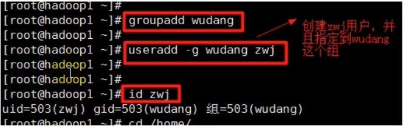

#### 3.修改用户组

​	usermod -g 用户组 用户名

#### 4.用户和组的配置文件

- /etc/passwd	用户配置文件（用户信息）

- /etc/group 	组配置文件（组信息）
- /etc/shadow	口令配置文件（密码和登录信息（加密））

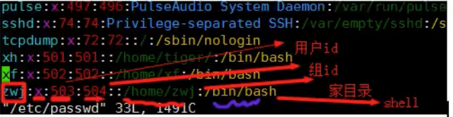

​	-- **/etc/shadow文件**

​	口令的配置文件

​	每行的含义：

​		登录名 : 加密口令：最后一次修改时间：最小时间间隔：最大是时间间隔：警告时间：不活动时间：失效时间：标志

​	--**/etc/group 文件**

​	组配置文件，记录linux包含组的信息

​	每行含义：

​		组名：口令：组表示号（id）：组内用户列表

## 3.linux实用指令

### 	**3.1 linux指定运行级别**

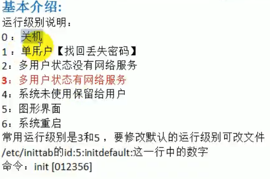

**运行级别示意图**

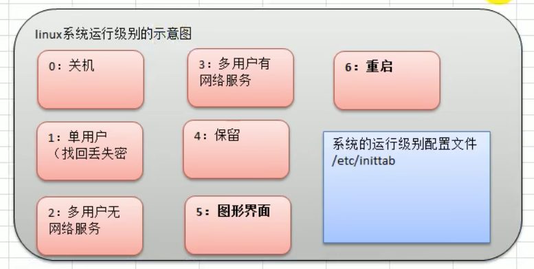

### 3.2 切换到自会顶运行级别的指令

**基本语法**

​	init[0123456]

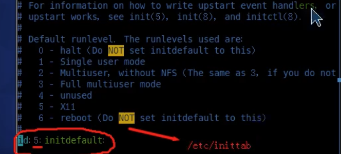

init 3 切换到3

init 0 关机

*面试题：*

​	如何找回root密码？

-进入当用户模式，然后修改root密码。因为单用户模式，root不需要密码

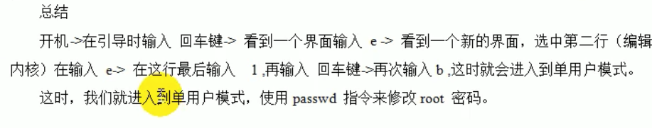

--不能远程连接，只能本机使用

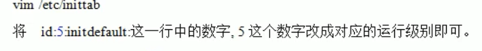

### 3.3帮助指令

##### 	3.3.1 man  获得帮助信息

> - 基本语法：
>
>
> ​			man [命令或配置文件] （功能描述：获得帮助信息）
>

​		

##### 2.help指令

> - 语法：help (获取shell内置命令的帮助信息)
>
>
> ​	help cd

### 3.4 文件目录类

#### 	3.4.1 pwd指令

> - 语法：pwd （显示当前工作目录绝对路径）
>

#### 	3.4.2  ls 指令

> - 语法：
>
>    ls【选项】【目录或是文件】
>
> - 常用选项：
>
>   -a : 显示当前目录所有的文件和目录，包括隐藏的
>
>   -l : 以列表的方式显示信息

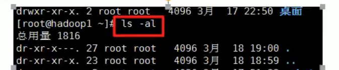

#### 3.4.3  cd 指令

> - 语法： 
>
>   cd 【参数】（切换到指定目录）
>
> - **常用参数**:
>
> ​		绝对路径和相对路径
>
> ​		cd~ 或者cd ：回到自己的家目录
>
> ​		cd.. 回到上一级目录

#### 3.4.4  mkdir 指令

​	mkdir指定用于创建目录(make directory)

> - **语法**：
>
>   mkdir 【选项】 要创建的目录
>
> - **常用选项**：
>
> ​	-p：创建多级目录

示例：

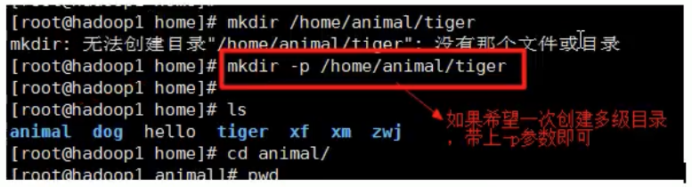

#### 3.4.5 rmdir 指令

删除指定目录

> - 语法：
>
>   rmdir【选项】 要删除的空目录
>
> - **注意：**
>
> ​	rmdir删除的是空目录，目录有内容情况下无法删除，如果需要删除非空目录，需要使用   rm -rf 要删除的目录 
>

实例：

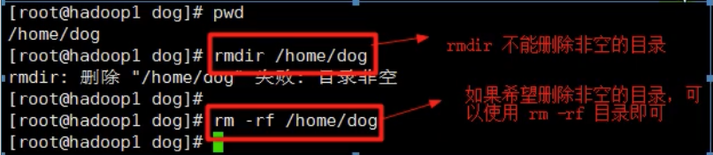

#### 3.4.6 touch 指令

touch指令 创建空文件

> - 语法：
>
>   touch 文件名
>

#### 3.4.7 cp 指令*

cp 拷贝文件到指定目录

> - 语法：
>
>   cp【选项文件】 source dest（目录）
>
> - **常用选项**
>
>   -r：递归复制整个文件夹
>

实例：

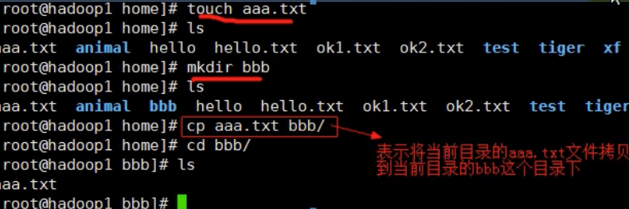

- 将整个目录拷贝 

  

**使用细节**：

​	强制覆盖不提示方法：\cp

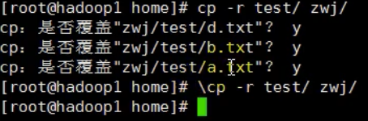

#### 3.4.8 rm指令

rm 移除文件或目录

> - **语法**：
>
>   rm【选项】要删除的文件或目录
>
> - **常用选项**
>
>   -r递归删除整个文件夹
>
>   -f：强制删除不提示

**示例：**

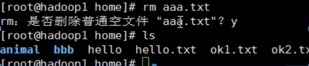

强制删除

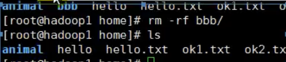

#### 3.4.9 mv 指令

​	移动文件与目录 或 重命名

> - **语法**：
>
>   mv oldNameFile newNameFile（重命名）
>
>   mv /temp/movefile   /targetFolder (移动文件 )

实例：

重命名

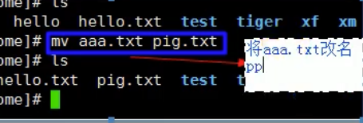

#### 2.4.10 cat 指令

​	查看文件内容，（以只读的方式打开）

> - **语法**：
>
>   ​	cat 【选项】 要查看的文件
>
> - **常用选项**：
>
>   ​	-n ：显示行号
>
>   ​	 |  more     分页显示
>
> - 实例
>
>   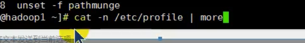
>

#### 3.4.11 more指令

​	more 是一个基于vi编辑器的文本过滤器，以全屏幕的方式按分页显示文本文件的内容；more指令内置若干快捷键

> - 语法：
>
>   ​	more 要查看的文件
>
> - 操作说明
>
> 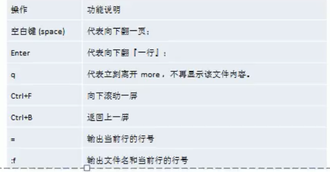
>

- 实例

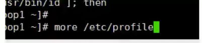

#### 3.4.12 less指令

​	less 用来分屏查看文件内容，功能与more类似，但比more更强大，支持各种显示终端。less在显示时 ，是根据显示需要加载显示内容，对于大型文件有较高效率 

> - **语法**：less 要查看的文件
> - **操作说明**：
>
> 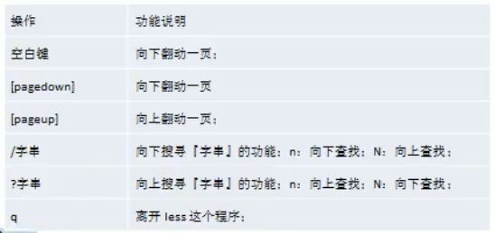
>

#### 3.4.13 >指令和>>指令

​	· >输出重定向和  >> 追加

> - 语法：
>   - ls -l > 文件 		（列表内容写入a.txt中（覆盖写））
>   - ls -al >> 文件      （列表内容追加到文件a.txt末尾）
>   - cat 文件1 > 文件2   （将文件1内容覆盖到文件2）
>   - echo "内容" >> 文件 （）

- 实例：
  1. ls -l >文件

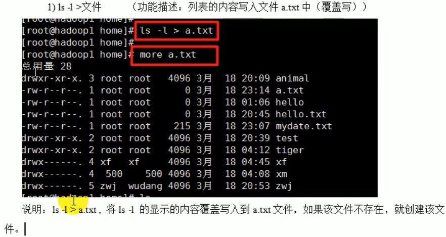

​		

		2. ls -al >> 文件  

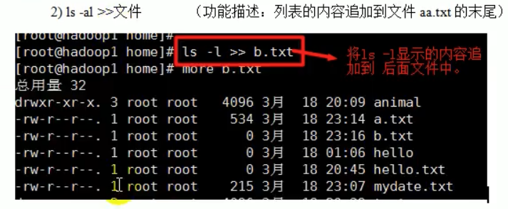

	3. cat 文件1 > 文件2

- 案例：

  将当前日历信息，追加到 /home/mycal 文件中

  [显示日历信息 cal]

  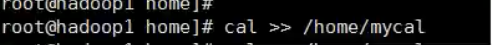

#### 3.4.14 echo指令 

​	echo 输出内容到控制台

> 语法：
>
> ​	echo [选项] [输出内容]

实例：

​	输出当前环境变量路径：

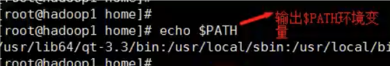

#### 3.4.15 head 指令

​	head 用于显示文件的开头部分内容，默认情况下head指令显示文件的前10行内容

> 语法：
>
> ​	head 文件 		（查看文件前10行内容）
>
> ​	head -n 5 文件    （查看文件头5行内容，5可任意）

- 实例：

  ​	查看文件前5行

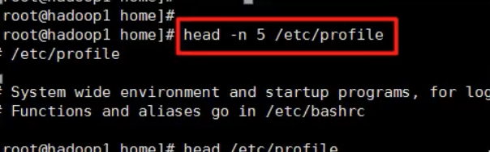

#### 3.4.16 tail指令

​	tail用于输出文件尾部内容， 默认情况下tail指令显示文件后10行内容

> 语法：
>
> - tail 文件		（查看文件后10行内容）
> - tail -n 5 文件  （查看文件后5行内容， 5可任意）
> - tail -f 文件      （实时追踪文档更新）

- 实例：

  实时监控文件查看是否变化：

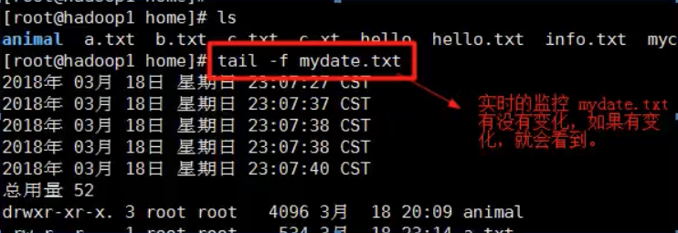

#### 3.4.17 ln 指令 

​	软连接指令   类似window 的快捷方式   

> 语法：
>
> ​	ln -s [源文件或目录] [软连接名]      (给源文件创建一个软连接)

- 实例：
  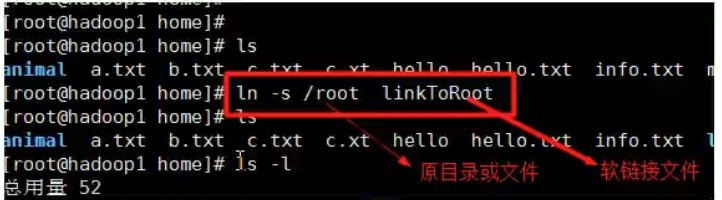

删除软连接

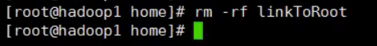

- **细节说明**：

  ​	当使用pwd查看指定目录时，看到的仍然是软连接所在的目录

  

#### 3.4.18 history 指令

​	查看已经执行过的所有命令，也可执行历史指令

> 语法:
>
> ​	history 查看执行过的历史指令

- 实例：

  执行历史指令

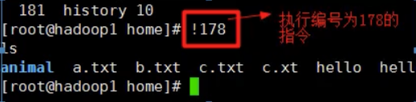

### 3.5 时间日期类

#### 3.5.1 date 指令-查看日期

 	显示当前时期

> **语法**：
>
> - date  	(显示当前时间)
> - date +%Y    (显示当前年份)
> - date +%m    (显示当前月份)
> - date +%d    （显示当前日）
> - date "+%Y-%m-%d %H:%M:%S"    (显示年月日时分秒)

#### 3.5.2 date 指令-设置日期

> 语法：
>
> - date -s 字符串时间

#### 3.5.3 cal 指令

​	查看日历指令

> 语法：
>
> - cal [选项]    （不加选项，显示本月日历）

实例：

​	显示2020的日历

- cal 2020

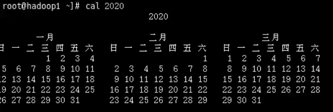

### 3.6 搜索查找类

#### 3.6.1 find 指令

find将从指定目录向下递归遍历器各个子目录，将满足条件的文件或目录显示在终端

> 语法：
>
> - find [搜索范围] [选项]
>
> 选项说明：
>
> | 选项            | 功能                           |
> | --------------- | ------------------------------ |
> | -name<查询方式> | 按照指定文件名查找模式查找文件 |
> | -user<用户名>   | 查找属于指定用户名所有文件     |
> | -size<文件大小> | 按照指定文件大小查找文件       |
>
> 

实例：

​	查找问文件大小大于20兆的

​	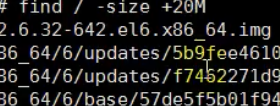

​	查看文件大小

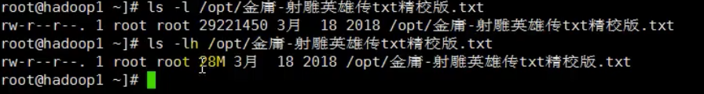

查找 / 目录下 ，所有.txt文件

#### 3.6.2 locate 指令

`locate`可以快速定位文件件路径，利用事先建立的系统中所有文件名称及路径的locate数据库事先快速定位给定的文件。locate指令无需遍历整个文件系统，查询速度较快。为保证查询结果准确度，管理员必须定期更新`locate`时刻

> 语法：
>
> - locate <u>搜索文件</u>
>
> **特别说明**：
>
> - 由于locate指令基于数据库进行查询，所以第一次运行前，必须使用updatedb指令创建locate数据库
>
> 

实例:

​	使用locate快速定位到hello。txt文件所在目录

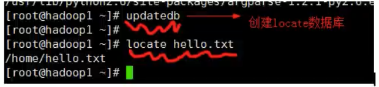

#### 3.6.3 grep 指令 和 管道符号 |

​	grep过滤查找，管道符，“|”表示将前一个命令处理结果输出传递给后面的命令处理

> 语法：
>
> - grep [选项] 查找内容 源文件
>
> 常用选项：
>
> | 选项 | 功能             |
> | ---- | ---------------- |
> | -n   | 显示匹配行及行号 |
> | -i   | 忽略字母大小写   |
>
> 

实例：
	在hello。txt文件中查找“yes”所在行并显示行号

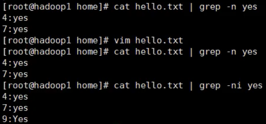

管道符的使用

### 3.7压缩和解压类

#### 3.7.1 gzip/gunzip 指令

gzip用于压缩文件，gunzip用于解压

> 语法：
>
> - gzip 文件		（压缩文件，只能将文件压缩为*.gz文件）
> - gunzip 文件.gz    （解压缩文件命令）

实例：

​	压缩文件

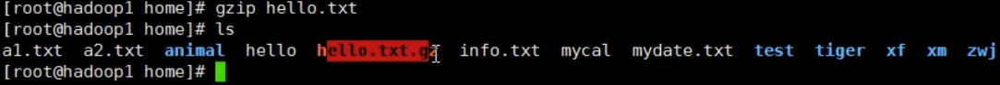

`注意`：

- 当我们使用gzip对文件进行压缩后，不会保留原来

解压缩

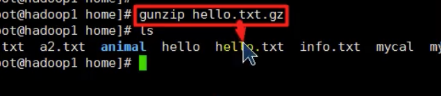

#### 3.7.2 zip/unzip 指令

​	zip用于压缩文件，unzip用于解压，这个在项目项目打包发布中很有用

> **语法**：
>
> - zip [选项] xxx.zip [将要压缩的内容] （压缩文件和目录的命令）
> - unzip [选项] xxx.zip （解压缩文件）
>
> **常用选项**：
>
> ​	`zip`:
>
> - -r ： 递归压缩，即压缩目录
>
>   `unzip`：
>
> - -d<目录> : 指定解压文件的存放目录

实例：
	将/home目录下所有文件压缩成mypackage.zip

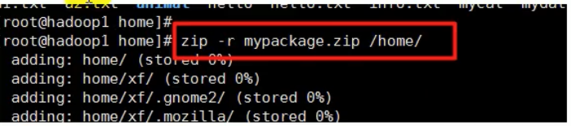

完成后获得

解压命令

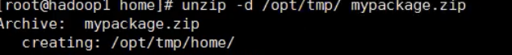

#### 3.7.3 tar 指令

tar 指令是打包指令，最后打包的文件是.tar.gz文件

> **语法**：
>
> - tar [选项] xxx.tar.gz 【打包的内容】 （打包目录，压缩后的文件格式.tar.gz）
>
> **选项说明**：
>
> | 选项 | 功能               |
> | ---- | ------------------ |
> | -c   | 产生.tar打包文件   |
> | -v   | 显示详细信息       |
> | -f   | 指定压缩后的文件名 |
> | -z   | 打包同时压缩       |
> | -x   | 解包.tar文件       |
>

实例：

​	压缩多个文件，将/home/a1.txt和/home/a2.txt压缩成 a.tar.gz

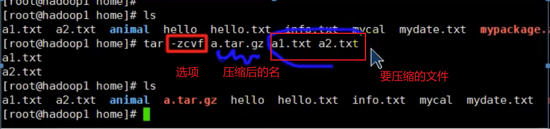

将home整个目录压缩myhome.tar.gz

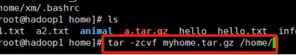

解压

**注意**：

​	指定解压到那个的目录。事先要存在才能成功，否则会报错

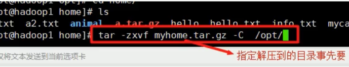

## 4.linux 组管理和权限管理

### 4.1Linux组基本介绍

​	在linux中每一个用户必须属于一个组，不能独立于组外。在linux中每个文件

有所有者、所在组，其他组的概念。

> 1）所有者
>
> 2）所在组
>
> 3）其他组
>
> 4）改变用户所在的组

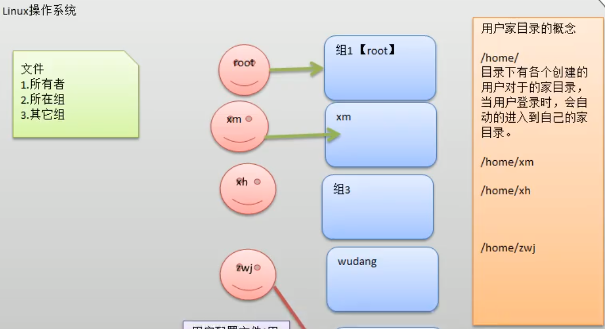

### 4.2文件/目录 所有者

​	一般为文件的创建者，谁创建了该文件，就自然的成为该文件的所有者

> **查看文件的所有者**
>
> - 指令: ls -ahl 
>
> **修改文件所有者**
>
> - 指令：chown 用户名 文件名

